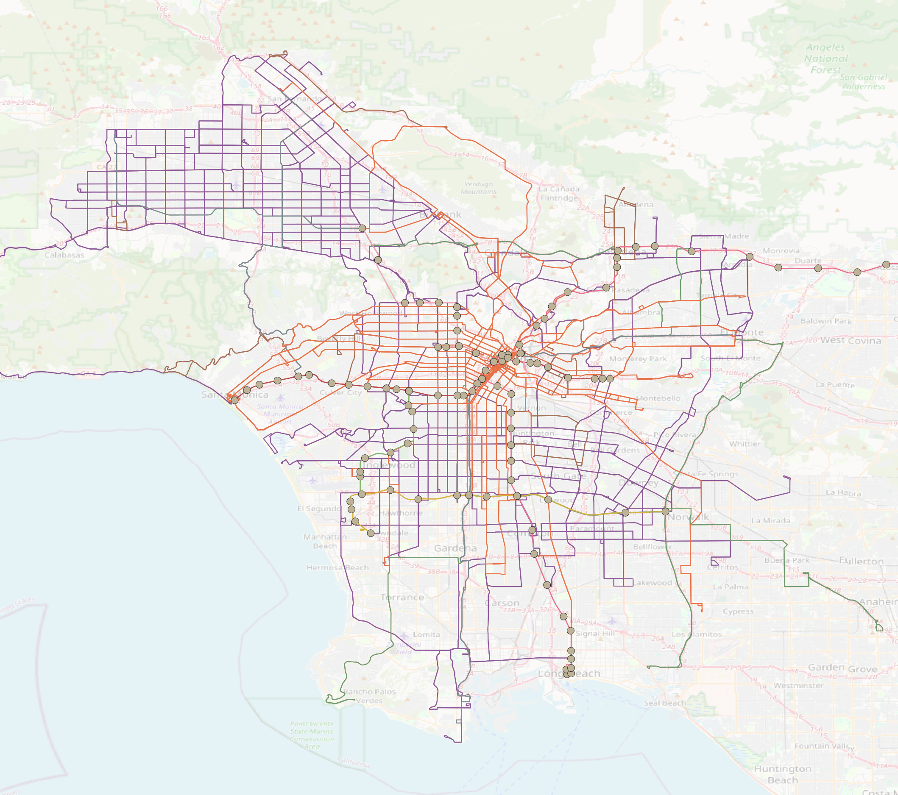
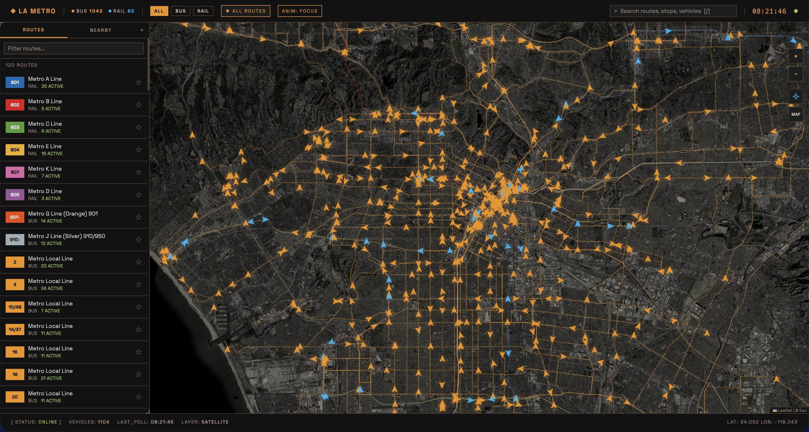
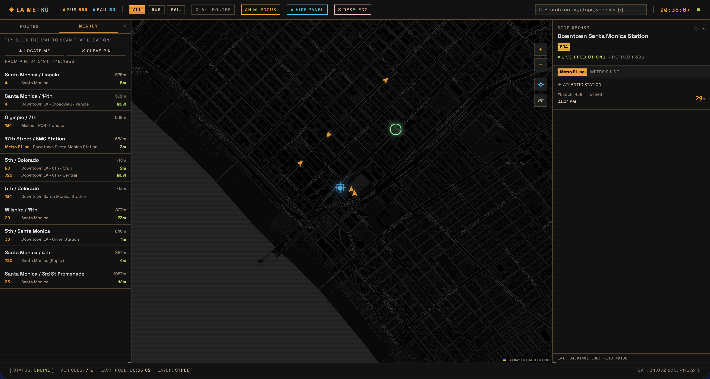
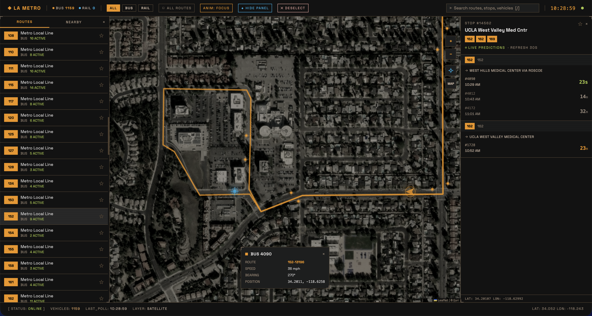
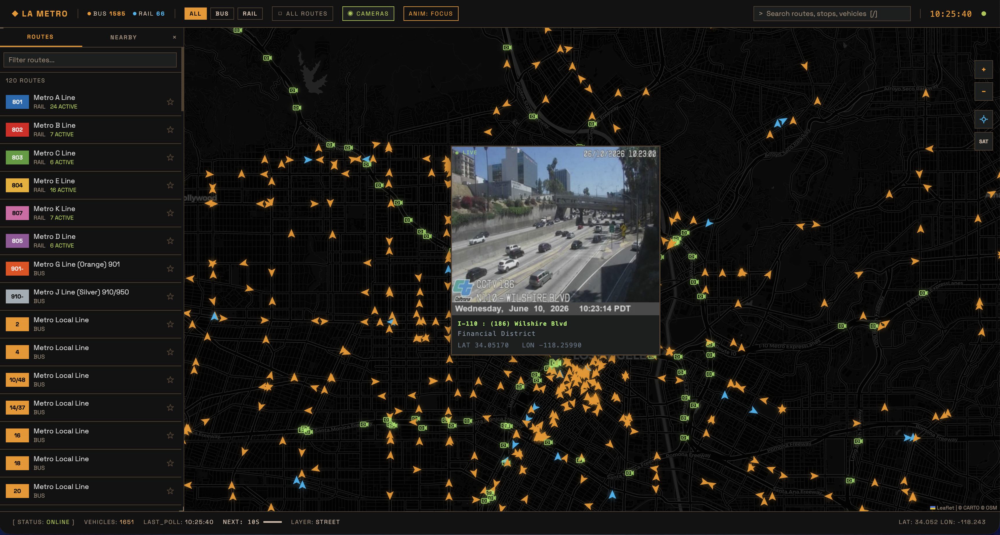
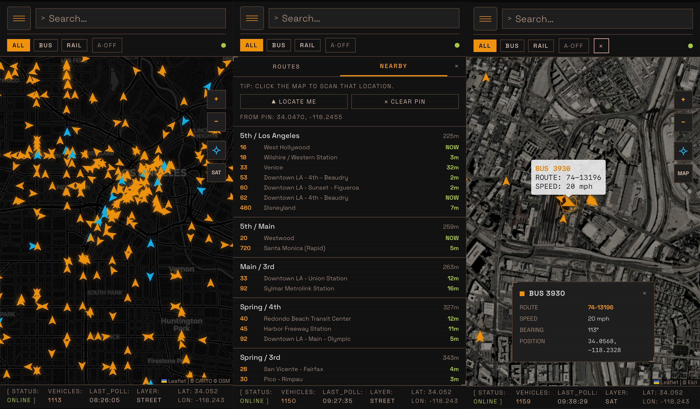

# LA Metro Real-Time Tracker

A real-time web app that shows the live location of every **[LA Metro](https://www.metro.net/)** bus and train on a tactical-terminal–styled map. Positions are polled from the [Swiftly](https://swiftly-inc.com/) GTFS-RT feeds and streamed to the browser over Server-Sent Events; static route, stop, and shape data comes from LA Metro's published GTFS bundles.

#### LA Metro Routes


_All the LA Metro bus and rail routes (LA Metro rail stations are also shown). LA Metro is one of the 27 public transit agencies in Los Angeles county that accepts [the TAP card](https://www.taptogo.net/)._

## UI






#### Mobile views



#### Walkthrough

Walkthrough of the app is available [here](https://youtu.be/fyqwtBetRT4).

## Features

- **Live vehicle map** — all active vehicles rendered as directional arrows (amber buses, cyan trains), smoothly interpolated between 10 s polls.
- **Route browser** — filterable, favoritable list of all LA Metro bus and rail routes with live per-route vehicle counts.
- **Route focus view** — selecting a route zooms the map to fit the line, draws the shape with a glow, and filters the map to only that route's active vehicles.
- **Stop detail + real-time predictions** — live arrival countdowns for each destination, pulled from Swiftly's `predictions` endpoint (refreshed every 30 s).
- **Nearby** — finds stops within 800 m of your GPS location, _or_ of any location you click on the map.
- **Full-network overlay** — an "All routes" toggle draws every LA Metro route as a faint skeleton; hover for the route name, click to drill in.
- **Traffic cameras** _(desktop only)_ — a `○ CAMERAS` toggle overlays ~500 Caltrans CCTV locations across LA County. Click any marker to open a popup with a live still image, location name, nearby place, and coordinates. Camera list is fetched from the Caltrans CWWP2 feed and cached for 24 h; the image itself is always fresh (the URL stays constant but Caltrans updates the content every ~2 min).
- **Poll countdown** _(desktop only)_ — the status bar shows `NEXT: XXs` with a shrinking bar so you can see exactly when the next vehicle poll fires.
- **Search** — fuzzy search across routes, stops, and live vehicle IDs (`/` to focus).
- **Selection emphasis** — the selected vehicle / stop grows, glows, and pulses; `Esc` or the header's `✕ DESELECT` button clears.
- **Tactical design system** — dark palette (amber / cyan / lime), Space Grotesk, scanline overlay, corner brackets, segmented progress bar, custom reticle cursor. Responsive down to mobile.
- **PWA-ready** — installable with a web manifest, `theme-color`, and mobile-web-app meta tags.

## Tech stack

| Layer     | Choice                                                                 |
| --------- | ---------------------------------------------------------------------- |
| Backend   | Node 20+, Express 4, `better-sqlite3`, `helmet`, `compression`, `cors` |
| Frontend  | React 19, Vite 6, Tailwind CSS 4, Leaflet 1.9 (`react-leaflet` 5)      |
| State     | Zustand 5 (with `localStorage` persistence for favorites)              |
| Animation | Framer Motion 12 + hand-rolled SVG/Canvas effects                      |
| Realtime  | Server-Sent Events (SSE), browser `EventSource`                        |
| Map tiles | OSM (street) / Esri World Imagery (satellite)                          |

## Project layout

```
la-metro/
├── freezer/                 # Throwaway UI experiments (flow-field, etc.)
├── notes/                   # Design notes + example Swiftly payloads
│   └── latest/lametro/
│       ├── lametro_latest/       # Static GTFS — bus
│       └── lametro_rail_latest/  # Static GTFS — rail
├── src/
│   ├── server/              # Express API + Swiftly poller + SQLite layer
│   │   ├── db/              # better-sqlite3 connection + schema
│   │   ├── routes/          # /api/* Express routers
│   │   ├── services/        # swiftly.js, gtfs.js, poller.js
│   │   └── scripts/
│   │       └── seed-gtfs.js # One-shot static GTFS → SQLite importer
│   ├── client/              # React + Vite app
│   │   ├── components/      # HUD, map layers, sidebar, detail panels, boot
│   │   ├── lib/             # api, store, utils, constants
│   │   └── styles/index.css # Tactical design tokens + cursors
│   ├── data/                # SQLite DB (generated, gitignored)
│   ├── dist/                # Vite build output (generated, gitignored)
│   ├── .env                 # SWIFTLY_API_KEY + PORT (not committed)
│   ├── package.json
│   └── vite.config.js
└── README.md (this file)
```

## Running locally

### Prerequisites

- Node.js 20+
- npm 10+
- A Swiftly API key (LA Metro provides one on request — see the [Swiftly public-facing-api docs](https://swiftly-inc.atlassian.net/servicedesk/customer/portals))

### First-time setup

```bash
cd src
npm install

# Create .env in src/
cat > .env <<EOF
SWIFTLY_API_KEY=your_key_here
PORT=3001
EOF
```

The `notes/` directory is git-ignored, so on a fresh clone you need to put the static GTFS files in place before seeding:

```bash
mkdir -p ../notes/latest/lametro/lametro_latest
mkdir -p ../notes/latest/lametro/lametro_rail_latest

# Download + unzip the feeds (see "Updating static GTFS data" below for URLs)
curl -L https://developer.metro.net/gtfs/google_transit.zip \
  | tar -xf - -C ../notes/latest/lametro/lametro_latest
curl -L https://developer.metro.net/gtfs/google_transit_rail.zip \
  | tar -xf - -C ../notes/latest/lametro/lametro_rail_latest
```

Then import into SQLite (~30 s, idempotent):

```bash
npm run seed
```

### Start dev servers

```bash
npm run dev
```

This runs both the Express API (port 3001) and the Vite dev server (port 5173) concurrently. Open [http://localhost:5173](http://localhost:5173).

Vite is configured with `host: '0.0.0.0'`, so you can also hit the app from a phone on the same Wi-Fi via `http://<your-mac-ip>:5173`.

### Production build

```bash
npm run build   # bundle the client into src/dist/
npm start       # runs the Express server with the built client served as static
```

## Updating static GTFS data

LA Metro republishes GTFS bundles whenever routes, stops, or schedules change. To refresh:

1. Download the latest static feeds:
   - Bus: <https://developer.metro.net/gtfs/google_transit.zip>
   - Rail: <https://developer.metro.net/gtfs/google_transit_rail.zip>
2. Unzip them and replace the contents of:
   - `notes/latest/lametro/lametro_latest/` (bus)
   - `notes/latest/lametro/lametro_rail_latest/` (rail)

   > These paths are hard-coded in `src/server/scripts/seed-gtfs.js` (`FEEDS` array). The `notes/` directory is git-ignored — if you freshly clone the repo you'll need to create the folders and drop the GTFS `.txt` files in yourself before the first `npm run seed`.

3. Re-run the seeder:
   ```bash
   cd src
   npm run seed
   ```
   The script **drops and rebuilds** every GTFS table, so it's fully idempotent. Restart the dev server afterwards.

## How to use the app

### Default view

All active LA Metro vehicles are shown. Arrows point in the direction of travel (from the `bearing` field — not always present). Buses are **amber**, rail is **cyan**.

### Filters (header)

- `ALL / BUS / RAIL` — filter the map by mode.
- `◻ ALL ROUTES` — toggle the full route-network skeleton overlay. Hover a line for the route name, click to select.
- `○ CAMERAS` _(desktop only)_ — overlay Caltrans CCTV camera locations. Click a marker for a live image popup (image refreshes on every popup open).
- `ANIM: FULL / FOCUS / OFF` — cycle the vehicle-animation mode (see Performance notes). Your choice is persisted to `localStorage`.
- `✕ DESELECT` — appears when anything is selected; clears route / stop / vehicle selection (or press `Esc`).

### Sidebar (`s` to toggle)

- **ROUTES tab** — every Metro route, sortable and filterable. Click to focus; click the ★ to favorite (stored in `localStorage`).
- **NEARBY tab** — uses your browser geolocation by default; clicking anywhere on the map while this tab is open drops a pin and re-runs the search from there. Buttons: `▲ LOCATE ME`, `✕ CLEAR PIN`.

### Search (`/` to focus)

Searches routes, stops (by name or code), and **live vehicle IDs** in one dropdown. Selecting a result highlights the item on the map.

### Stop detail

Clicking a stop opens the right-hand panel with live arrival countdowns per destination. The `LIVE predictions` badge indicates the data is coming from Swiftly's real-time predictions endpoint (refreshed every 30 s, cached 15 s server-side).

### Map controls

- Zoom in/out, locate me, and toggle **street / satellite** mode (bottom-right).

### Traffic cameras _(desktop only)_

Click `○ CAMERAS` in the header to overlay green camera icons across LA County (Caltrans District 7). Click any icon to open a popup containing:

- A live JPEG still from the camera (refreshed on each popup open)
- Location name and nearby place
- GPS coordinates

Data source: [CWWP2 — California Department of Transportation (Caltrans)](https://cwwp2.dot.ca.gov/) — the Commercial Wholesale Web Portal that provides real-time traveler information for all 12 Caltrans districts. The District 7 (Los Angeles County) JSON feed is at `https://cwwp2.dot.ca.gov/data/d7/cctv/cctvStatusD07.json`. The feed is cached for 24 hours; the image URL is permanent but Caltrans updates the JPEG every ~2 minutes.

### Poll countdown _(desktop only)_

The footer status bar shows `NEXT: 09s` with a small progress bar counting down to the next vehicle poll. Resets to 10 s after each poll arrives.

### Keyboard shortcuts

| Key   | Action                    |
| ----- | ------------------------- |
| `/`   | Focus the search box      |
| `s`   | Toggle the sidebar        |
| `Esc` | Deselect / close dropdown |

## Architecture overview

```
  Browser (React/Vite)                     Express (Node)                  Swiftly
 ─────────────────────────────           ─────────────────────           ──────────────
  Leaflet ← vehicles (SSE) ◄──────────── /api/vehicles/stream ◄────── poll 10 s ───┐
           ← routes/stops (REST) ◄───── /api/routes · /api/stops       (vehicles)   │
           ← predictions (REST) ◄────── /api/predictions   ────────── /predictions  │
           ← search (REST) ◄──────────── /api/search                   every req    │
                                         │                                          │
                                         ├── better-sqlite3 (static GTFS)           │
                                         └── in-memory cache ◄── poll 30 s ─────────┘
                                                                      (trip updates)
```

- **SSE compression**: Compression is explicitly disabled for `/stream` endpoints — `compression` middleware would otherwise buffer the stream until a gzip block fills, causing minutes-long delays before the first event reaches the client. The server also sends a 20 s heartbeat comment to keep the connection alive across proxies.
- **Interpolation**: The client interpolates linearly between each 10 s position update so arrows drift continuously rather than hopping. Jumps of more than ~2.5 km between polls (almost always bad AVL data) are teleported instead of smeared across the map.
- **Stale-speed masking**: The store records `vehicleLastMovedAt` per vehicle from successive API positions. If a vehicle's reported position hasn't changed for > 25 s, both the **map tooltip and the selected-vehicle card** show `0 mph` / `(idle)` even if Swiftly still reports a non-zero speed. The card re-evaluates every second so the idle state matches the tooltip.
- **Shape simplification**: Route shapes use Douglas–Peucker simplification (ε ≈ 0.00008 per route, ε ≈ 0.0004 for the "All routes" overlay) to keep payloads small and rendering fast.
- **Vehicle enrichment**: Real-time `vehicle-positions` responses don't always include a `routeId`; the server merges in data from the parallel `trip-updates` cache to fill in routes where possible. Vehicles still missing a route (dead-heading / depot) are filtered out of the map.

## API endpoints

All endpoints are served under `/api` on the Express server (port 3001 by default). The client talks to them via `src/client/lib/api.js`.

| Method + Path                                   | Description                                                                 |
| ----------------------------------------------- | --------------------------------------------------------------------------- |
| `GET /api/vehicles`                             | Snapshot of currently known vehicles. Supports `agency`, `routeId` filters. |
| `GET /api/vehicles/stream`                      | Server-Sent Events stream of vehicle updates (every 10 s).                  |
| `GET /api/vehicles/:vehicleId`                  | Single vehicle by ID.                                                       |
| `GET /api/routes`                               | All GTFS routes.                                                            |
| `GET /api/routes/:agency/:routeId`              | One route with its simplified shape(s).                                     |
| `GET /api/routes/:agency/:routeId/stops`        | Stops served by a route.                                                    |
| `GET /api/routes/shapes/all`                    | Simplified geometry for every route (for the overlay).                      |
| `GET /api/stops/:agency/:stopId`                | One stop + routes serving it.                                               |
| `GET /api/predictions/stop/:stopId`             | Live arrival predictions for a stop (Swiftly proxy).                        |
| `GET /api/predictions/nearby?lat=&lon=&radius=` | Live predictions within a radius (Swiftly proxy).                           |
| `GET /api/search?q=`                            | Searches routes, stops, and vehicles.                                       |
| `GET /api/status`                               | DB stats, poller status, uptime.                                            |

## Environment variables

| Variable          | Default | Purpose                                          |
| ----------------- | ------- | ------------------------------------------------ |
| `SWIFTLY_API_KEY` | —       | Required. Passed to Swiftly as `Authorization`.  |
| `PORT`            | `3001`  | Express server port.                             |
| `NODE_ENV`        | —       | Set to `production` to serve `dist/` statically. |

## Performance notes

- **Vehicle poll**: every 10 s, matching the cadence of Swiftly's upstream feed.
- **Trip-update poll**: every 30 s. Used only for enriching vehicle rows with `routeId` / `directionId`.
- **Animation modes** (header toggle, persisted in `localStorage`, default depends on device):
  - `FULL` — every visible vehicle interpolates smoothly over the 10 s poll (default on desktop).
  - `FOCUS` — only the selected vehicle and the vehicles of the selected route animate; all other markers snap to each new position.
  - `OFF` — no interpolation; every marker teleports on each poll. Lightest possible CPU load. **Default on touch / narrow viewports** (first visit; still overridable and persisted in `localStorage`).
- **Interpolation loop**: ~15 fps (`setTimeout` 67 ms). Completed interpolations are evicted from the animation map so idle vehicles cost nothing.
- **Rendering**: Leaflet is configured with `preferCanvas: true`. Vehicle markers are `divIcon` (SVG) so they can rotate with `bearing`; stop markers and the all-routes overlay use Canvas.
- **Static payloads**: Route shapes are simplified server-side and cached in process. `GET /api/routes/shapes/all` is also HTTP-cached for 1 hour.
- **Compact / touch layout** (phones, iPads in portrait and landscape, and windows ≤ 1024px): the header is **two rows** — (1) menu + full-width **Search…** input, (2) filters, animation, **`◆ PANEL` / `◆ HIDE`**, deselect, and connection dot. Live **BUS / RAIL counts** stay in the header on wide desktop only; **status bar** still shows the total. **iPad vs desktop** at the same width: `(pointer: coarse) and (max-width: 1366px)` uses the compact layout; mouse users on wide screens keep the single-row header (`src/client/lib/layout.js`).
- **Mobile defaults**: the left sidebar starts collapsed and animation mode defaults to `OFF`. The stop / predictions full-screen panel opens when you select a stop; use **`◆ PANEL` / `◆ HIDE`** in the second header row or the floating `◈` pill. The shell uses `min-h-0` + `dvh` so the map does not cover the header.

## Troubleshooting

- **"CONNECTING" never resolves** — verify `SWIFTLY_API_KEY` is set and check the backend terminal for `[swiftly]` errors.
- **Backend 502 / 503** — Swiftly rate-limits and occasionally returns errors; the poller logs and retries on the next interval.
- **Seed script runs out of memory** — it uses streaming CSV + batched inserts. If you still hit issues, increase Node's heap: `NODE_OPTIONS=--max-old-space-size=4096 npm run seed`.
- **Map is grey** — the tile server is refusing requests (rate limit). Wait a minute, or switch to satellite mode.

## Relevant links

- **Data**
  - [LA Metro Developer Portal](https://developer.metro.net/)
  - [LA Metro GTFS static](https://developer.metro.net/gtfs-schedule-data/)
  - [LA Metro Real Time APIs](https://developer.metro.net/api/)
  - [Swiftly public-facing API docs](https://swiftly-inc.stoplight.io/docs/realtime-standalone/d08fc97489edb-swiftly-api-reference)
  - [TAP Agencies](https://www.taptogo.net/TAPAgencies)
  - [GTFS reference](https://gtfs.org/documentation/schedule/reference/)
  - [GTFS Realtime reference](https://gtfs.org/documentation/realtime/reference/)
  - [Caltrans CWWP2 — real-time traveler information](https://cwwp2.dot.ca.gov/)
  - [Caltrans CWWP2 District 7 CCTV feed (LA County)](https://cwwp2.dot.ca.gov/data/d7/cctv/cctvStatusD07.json)
  - [Caltrans GIS open data](https://gisdata-caltrans.opendata.arcgis.com/)
- **Global Mobility Data**
  - [MobilityDatabase](https://mobilitydatabase.org/)
- **Libraries**
  - [Leaflet](https://leafletjs.com/) · [react-leaflet](https://react-leaflet.js.org/)
  - [React](https://react.dev/) · [Vite](https://vitejs.dev/)
  - [Zustand](https://zustand.docs.pmnd.rs/) · [Framer Motion](https://www.framer.com/motion/)
  - [Tailwind CSS](https://tailwindcss.com/) · [better-sqlite3](https://github.com/WiseLibs/better-sqlite3)

## License

All rights reserved. See [LICENSE](./LICENSE) file.

Private project — not licensed for redistribution.

Data © LA Metro & Swiftly; map tiles © OpenStreetMap and Esri.
